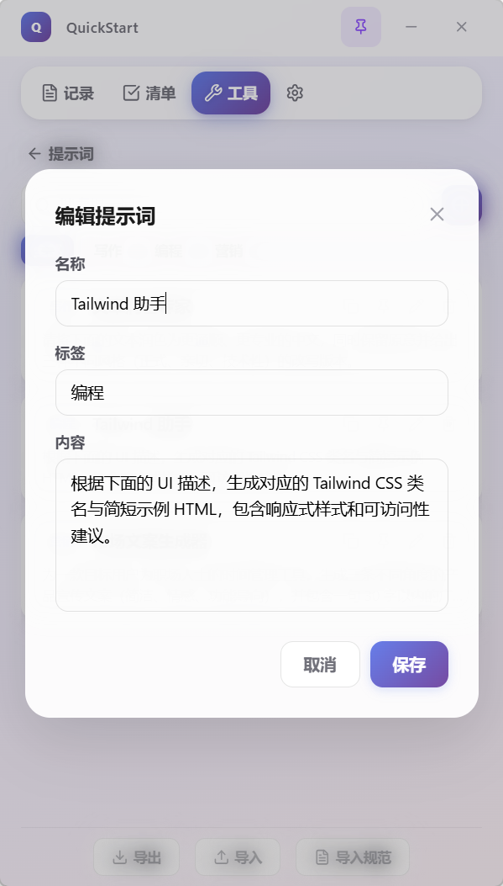
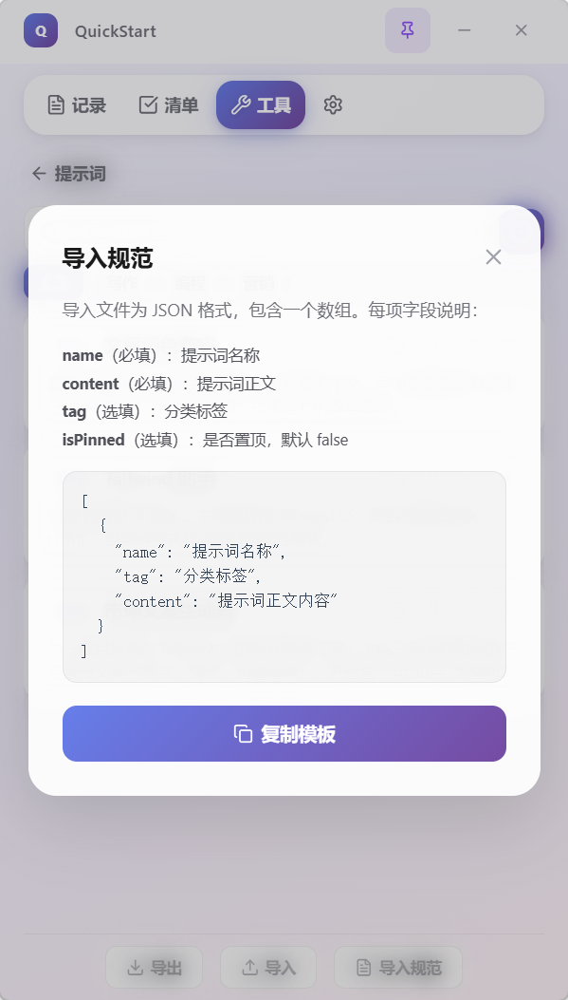

<p align="center">
  
</p>

<h1 align="center">QuickStart</h1>

<p align="center">
  <strong>桌面快捷效率工具 —— 记录、清单、翻译、AI 对话、剪贴板，一键直达</strong>
</p>

<p align="center">
  
  
  
  
  
</p>

---

## 简介

QuickStart 是一款基于 **Electron + React + TypeScript** 构建的桌面侧边栏效率工具。

写代码时突然有个想法？按下快捷键，侧边栏弹出，直接记录。遇到不认识的单词？切到翻译 Tab，AI 即时翻译。需要问 AI 一个问题？不用打开浏览器，直接在侧边栏对话。

**所有数据 100% 存储在本地，不上传任何服务器。**

---

## 功能模块

### 记录

<p align="center">
  
</p>

- **多工作区隔离** —— 下拉菜单快速创建、切换、重命名、删除工作区，每个工作区的记录完全独立
- **标题 + 正文** —— 结构化编辑，标题自动用于文件命名（智能清理特殊字符）
- **Markdown 编辑** —— 支持标准 Markdown 语法，`Ctrl+Enter` 快速保存
- **图片粘贴** —— `Ctrl+V` 直接从剪贴板粘贴图片，自动保存到本地并渲染缩略图
- **图片预览** —— 点击缩略图可放大查看，通过自定义协议 `quickstart://` 本地极速加载
- **按日期归档** —— 笔记自动按 `YYYY-MM/` 月份文件夹存储
- **编辑与删除** —— 点击卡片即可回填编辑，删除带 30 秒撤销保护
- **沉浸式搜索** —— 顶栏无缝展开搜索框，macOS 风格的平滑动画

---

### 清单

<p align="center">
  
</p>

- **按日管理** —— 每天一份独立的清单，左右箭头快速切换日期
- **全局存储** —— 清单数据不随工作区切换，始终可用
- **日历选择器** —— 点击日期弹出日历面板，标记有事项和未完成的日期
- **拖拽排序** —— 按住左侧六点手柄拖动即可调整事项顺序，松手自动保存
- **颜色标记** —— 8 种颜色可选，为不同优先级的事项设置醒目标识
- **进度条** —— 实时显示今日完成进度（如 1/2），一目了然
- **编辑弹窗** —— 点击事项文字弹出底部编辑卡片，宽敞的编辑区域

---

### 翻译

<p align="center">
  
</p>

- **AI 驱动翻译** —— 基于配置的 AI 节点进行智能翻译，非简单词典查询
- **自动检测语言** —— 输入中文自动翻译为英文，输入英文自动翻译为中文
- **流式输出** —— 翻译结果逐字显示，无需等待完整响应
- **一键复制** —— 翻译结果可一键复制到剪贴板
- **字数统计** —— 实时显示输入文本字数
- **快捷键** —— `Ctrl+Enter` 快速发起翻译

---

### AI 对话

<p align="center">
  
</p>

- **DeepSeek 深度集成** —— 支持 DeepSeek-V3、DeepSeek-R1 等模型，兼容 OpenAI 协议
- **流式打字机效果** —— 实时看到 AI 思考和回复过程
- **多会话管理** —— 创建、切换、删除独立对话，左侧滑出历史记录侧边栏
- **文件上传** —— 支持图片、文本、PDF 等多种格式作为上下文发送
- **自动标题** —— 新对话自动取首句作为标题
- **会话时间戳** —— 每条消息显示发送时间

---

### 剪贴板

<p align="center">
  
</p>

- **智能监听** —— 自动记录系统剪贴板中的文本和图片，去重存储
- **历史管理** —— 按时间倒序展示剪贴板历史，支持搜索过滤
- **全屏预览** —— 点击文本条目弹出沉浸式全屏 Modal，支持原地编辑
- **图片预览** —— 点击图片展开高清大图预览，支持快速复制
- **一键操作** —— 每条记录可快速复制、编辑、定位文件夹、删除
- **精确时间戳** —— 显示 `YYYY-MM-DD HH:mm:ss` 格式的完整时间
- **撤销删除** —— 删除后 30 秒内可撤销，防止误操作
- **本地存储** —— 文本存储为 JSON，图片自动保存为本地文件

---

### 设置

<p align="center">
  
</p>

- **记录存储** —— 独立配置记录根目录，工作区自动创建子文件夹，包含 Markdown 文本与图片附件
- **清单存储** —— 独立配置清单数据目录，全局存储不随工作区变化
- **剪贴板存储** —— 独立配置剪贴板数据目录，文本与图片统一管理
- **数据导出** —— 选择"记录"或"清单"，设定日期范围，一键导出为 Markdown 或 PDF
- **快捷日期预设** —— 今天、近 7 天、近 30 天、近 90 天一键选择
- **AI 节点管理** —— 多节点配置（支持对话、翻译或两者兼用），拖拽排序，独立开关
- **API Key 加密** —— 使用 AES-256-GCM 加密存储，验证连接后才保存
- **快捷键自定义** —— 可自定义全局唤起/隐藏快捷键
- **开机自启动** —— 一键开关，托盘菜单同步联动
- **撤销保护机制** —— 清空数据后显示 30 秒撤销进度条，可随时取消操作
- **数据自动迁移** —— 更改存储路径时自动迁移数据至新目录

---

## 版本更新

### v1.0.1 (2026-03-11)

- **修复**：打包安装后托盘点击「退出」无法正常退出程序（便签窗口 `close` 事件无条件 `preventDefault` 导致）
- **修复**：便签窗口尺寸与位置在重启后不持久化（`before-quit` 保存 bounds + `resize`/`move` 防抖保存）
- **修复**：编辑任务弹窗与导航栏重叠（`TaskEditModal` 用 `createPortal` 挂到 `document.body` 脱离层叠上下文）
- **优化**：便签任务展示逻辑 —— 单日任务完成后不再显示，未完成单日任务继续显示作为当日提醒
- **优化**：日历日期悬停 400ms 后弹出浮层，展示当日全部任务（含跨天任务），解决任务过多无法全部展示的问题

### v1.0.0 (2026-03-13)

#### 🎯 大更新：日历与清单体验全面升级

- **清单日历布局重构** —— 上下分层彻底消除日期与任务色条重叠
  - 上层：固定高度日期区（公历数字 + 农历/节气/传统节日）
  - 下层：独立任务色条区，永不与日期重叠
  - 农历显示：初一、廿五等；节气：立春、春分等（绿色）；传统节日：春节、元宵节等（红色）
  - 法定节假日：接入 NateScarlet/holiday-cn，休/班徽章（红/橙）标注调休与假期

<p align="center">
  
</p>

- **桌面便签日历同步** —— 便签浮动窗口日历采用相同上下分层 + 农历/节气显示，与主应用风格统一

<p align="center">
  
</p>

- **清单删除撤销** —— 点击删除立即移除，底部 30 秒撤销 Toast，可恢复并保存；删除按钮改为 X 图标 + hover 红底
- **便签固定锁定** —— 点击图钉固定后，禁用窗口拖拽、边框缩放、最小化、关闭，仅图钉可点击取消固定
- **新建任务默认日期** —— 在日历选中某日时新建任务，默认开始日期为该日而非今天

### v0.7.0 (2026-03-11)

#### 🎯 大功能

- **导航栏重构** —— 顶部 Tab 从 6 个精简为 4 个（记录、清单、工具、设置），翻译/AI/剪贴板合并到工具进入卡片首页
  - 工具首页卡片展示翻译、AI、剪贴板、提示词四大功能
  - 进入对应功能后自动高亮"工具" Tab，切换功能无缝衔接
  - 快捷键 `Ctrl+3` 快速打开工具首页

<p align="center">
  

- **新增提示词功能** —— 工具 Tab 中新增提示词管理工具，参照 prompt-master 设计
  - 卡片式列表展示，支持搜索、标签筛选
  - 支持新增/编辑/删除/置顶提示词
  - 内置 3 条默认提示词（文章润色、Tailwind 助手、市场文案生成）
  - 一键复制提示词到剪贴板，支持导入导出 JSON 备份
  - 数据本地存储（`dataDir/prompts.json`），首次加载自动初始化

<p align="center">
  
  
  
</p>

#### 🐛 清单模块优化

- **清单计时状态修复** —— 点击暂停后保持为"已暂停"状态，不再误判为"计时结束"
- **计时零值显示修复** —— 开始后立即暂停时，统一显示标准时长格式，不再出现裸 `0`
- **计时交互完善** —— 在"开始/暂停"之外补充"结束计时"入口，暂停后可继续或手动结束
- **清单排序逻辑优化** —— 新建未完成事项始终在未完成区；勾选完成后自动下沉到已完成区
- **专注时长样式统一** —— 完成态时长标签统一为"专注时长"视觉体系，完成状态增加明确勾选反馈
- **今日专注统计弹窗** —— 日期栏新增统计入口，支持弹窗查看当日专注总时长 + 各模块时长占比圆饼图
- **图表交互与排版打磨** —— 饼图标注、模块列表、hover 高亮与弹窗留白重新调整，避免遮挡与拥挤

#### 📋 剪贴板模块优化

- **剪贴板性能优化** —— 剪贴板页默认仅渲染前 100 条记录，降低从 AI 切换到剪贴板时的卡顿
- **剪贴板头部信息补充** —— 顶部显示“共 X 条，仅展示前 100 条”，明确展示范围
- **文本预览工具栏重绘** —— 预览弹窗右上角操作区改为轻量化按钮风格，视觉更简洁不压内容

### v0.6.3 (2026-02-18)

<p align="center">
  
  
  
</p>

- **计时器弹窗重构** —— 全新小米时钟风格的计时器交互弹窗，毛玻璃背景 + 大圆角设计
- **分段控制器** —— 正计时/倒计时切换采用 iOS 风格的滑动指示器，选中态平滑过渡
- **圆形拨盘选择器** —— SVG 精准绘制的圆形进度弧线，拖动把手设定倒计时分钟数
- **滑动开始** —— 正计时模式采用"滑动开始"交互，向右滑动触发计时
- **快捷时长 Chips** —— 统一规格的胶囊按钮（5/15/25/45分钟），单行显示，等宽布局
- **倒计时结束弹窗** —— 计时结束时弹出精致的完成弹窗，显示任务名称与专注时长
- **系统通知** —— 应用不在前台时，计时结束自动触发系统级通知提醒
- **编辑弹窗按钮优化** —— 取消/确定按钮统一规格（46px 高、14px 圆角），Primary/Secondary 层级清晰，支持 hover/pressed 状态
- **深色模式适配** —— 计时器弹窗、完成弹窗、编辑弹窗全组件支持深色模式

### v0.6.2 (2026-02-17)

- **AI 对话导出**：支持将 AI 对话导出为 Markdown (.md) 或 PDF (.pdf) 格式
- **AI Markdown 渲染**：AI 回复支持完整 Markdown 渲染，代码块语法高亮
- **复制功能增强**：AI 回复支持一键复制全文，代码块支持单独复制

### v0.6.1 (2026-02-17)

- **修复撤销倒计时卡顿** —— 修复设置页清空操作的撤销进度条在 29s 后停止跳动的问题

### v0.6.0 (2026-02-17)

- **新增剪贴板模块** —— 自动监听系统剪贴板，记录文本和图片历史，支持搜索、预览、编辑、复制、删除
- **沉浸式文本预览** —— 剪贴板文本条目点击后展开全屏毛玻璃 Modal，支持查看态与编辑态无缝切换
- **导航栏滑块动效** —— Tab 切换时紫色高亮滑块平滑过渡，采用 `cubic-bezier` 惯性曲线
- **撤销机制统一** —— 所有删除/清空操作均采用 30 秒进度条撤销模式，与记录模块风格一致
- **存储路径迁移增强** —— 更改存储目录时自动迁移数据，支持嵌套目录场景，原文件夹自动清理
- **工作区永久保护** —— 至少保留一个工作区不可删除，防止数据孤立
- **工作区删除撤销** —— 删除工作区后 30 秒内可撤销，物理文件延迟删除
- **快捷键扩展** —— `Ctrl+1~5` 切换前五个标签页，`Ctrl+,` 打开设置

### v0.5.2 (2026-02-15)

- **单条记录导出** —— 每条记录卡片新增导出按钮，点击弹出居中弹窗选择 Markdown 或 PDF 格式，单条记录即可独立导出
- **PDF 导出标题修复** —— 修复批量导出 PDF 时记录标题缺失的问题，现与 Markdown 导出一致包含 `## 标题`
- **记录时间显示优化** —— 最近记录列表的时间从仅显示时分改为完整的"年/月/日 时:分"格式
- **思维标记系统** —— 标题输入框左侧新增状态图标选择器（横向药丸菜单），支持 ⚠️ 思维陷阱、💡 核心灵感、📌 关键定稿三种标记，持久化存储并在列表中同步显示
- **沉浸式编辑模式** —— 点击编辑区域时输入框平滑展开覆盖最近记录列表，失焦后自动缩回，展开状态采用实色背景 + 浮动投影
- **删除反馈重构** —— 删除确认条重构为毛玻璃风格浮动 Snackbar，新增紫色渐变倒计时进度条、撤销胶囊按钮、底部滑入动画

### v0.5.1 (2026-02-09)

- **导出工作区选择** —— 数据导出"记录"模式新增自定义下拉菜单，可选择导出指定工作区的记录
- **导出文件名匹配修复** —— 修复标题命名的笔记（如「方法论.md」）无法被导出的问题，现通过 index.json 元数据匹配日期
- **导出内容标题** —— 导出的 Markdown/PDF 中每条记录自动包含标题（`## 标题`）

### v0.5.0 (2026-02-09)

- **工作区下拉菜单** —— 移除侧边栏抽屉，改为记录页顶部的轻量下拉菜单，支持创建/切换/重命名/删除工作区
- **删除工作区安全确认** —— 删除操作带 5 秒倒计时确认，明确警示"将同时删除本地记录文件"
- **存储路径分离** —— 设置页将"记录存储"与"清单存储"拆分为两个独立配置模块，各自可更改目录、恢复默认、清空数据
- **清单存储路径可配置** —— 新增清单数据目录的自定义配置（此前仅记录支持）
- **沉浸式搜索** —— 搜索栏改为 macOS 风格的顶栏无缝展开动画，左侧返回箭头 + 内联清除按钮
- **工作区按钮极简化** —— 去除紫色实色背景，改为纯文字 + 圆点 + 箭头的低调设计
- **标题栏简化** —— 移除标题栏的工作区指示器按钮，界面更干净
- **搜索空状态优化** —— 轻量化的搜索图标提示，减少视觉干扰

### v0.4.0

- 工作区作用域调整：只有"记录"受工作区隔离，清单/翻译/AI 为全局功能
- 清单数据迁移至全局 todos 目录

### v0.3.0

- 全局根目录 + 工作区命名子文件夹存储架构
- 设置页简化为单一根目录配置

### v0.2.0

- 引入工作区概念，支持多工作区隔离
- 记录重构为"标题 + 正文"模式，标题用于文件命名
- v0.1.0 数据自动迁移至默认工作区

### v0.1.0

- 基础功能：记录、清单、翻译、AI 对话
- 本地文件存储，自定义协议图片加载
- NSIS 安装包，自定义安装路径，用户协议

---

## 安装

### 下载安装包

前往 [Releases](https://github.com/ReappealXy/QuickStart/releases) 页面，下载最新版本的 `QuickStart Setup 1.0.1.exe`。

安装过程支持：
- 自定义安装目录
- 用户许可协议确认
- 安装完成后立即启动
- 自动创建桌面快捷方式

### 从源码构建

```bash
# 克隆仓库
git clone https://github.com/ReappealXy/QuickStart.git
cd QuickStart

# 安装依赖
npm install

# 开发模式运行
npm run dev

# 打包为安装程序
npm run build
```

---

## 隐私与安全

| 项目 | 说明 |
|------|------|
| 数据存储 | 所有数据存储在用户自定义的本地目录，不上传任何服务器 |
| API Key | 使用 AES-256-GCM 加密后保存在本地 config.json |
| 网络请求 | 仅在调用 AI 服务 API 时发起，无数据采集、无遥测 |
| 开源透明 | 完整源码公开，可审计 |

---

## 技术栈

| 层级 | 技术 |
|------|------|
| 框架 | Electron 40 + electron-vite |
| 前端 | React 19 + TypeScript |
| 样式 | Tailwind CSS 4 + 毛玻璃设计 |
| 状态管理 | Zustand |
| 拖拽排序 | @dnd-kit |
| AI 协议 | OpenAI 兼容 (流式 SSE) |
| 加密 | Node.js crypto (AES-256-GCM) |
| 导出 | markdown-it + Electron printToPDF |
| 打包 | electron-builder (NSIS) |

---

## 项目结构

```
QuickStart/
├── electron/
│   ├── main.ts          # 主进程（IPC、文件IO、AI请求、协议注册）
│   └── preload.ts       # 安全桥接层
├── src/
│   ├── components/
│   │   ├── AI/          # AI 对话界面
│   │   ├── Notes/       # 记录界面 + 工作区下拉菜单
│   │   ├── Todo/        # 清单界面
│   │   ├── Translator/  # 翻译界面
│   │   ├── Clipboard/   # 剪贴板界面
│   │   ├── Settings/    # 设置界面
│   │   └── Layout/      # 标题栏、导航栏
│   ├── stores/          # Zustand 状态管理
│   └── styles/          # 全局样式
├── build/
│   ├── icon.ico         # 应用图标
│   └── license.txt      # 安装协议
└── package.json
```

---

## 存储结构

```
记录存储根目录/
├── 默认/                 # 默认工作区文件夹
│   └── Notes/
│       ├── 2026-02/
│       │   ├── 标题名.md
│       │   └── ...
│       ├── attachments/  # 粘贴的图片附件
│       └── index.json    # 元数据索引
├── 学习记录/             # 自定义工作区文件夹
│   └── Notes/
│       └── ...
└── ...

清单存储目录/             # 全局清单（不随工作区切换）
├── 2026-02-08.json
├── 2026-02-09.json
└── ...

剪贴板存储目录/           # 剪贴板历史（文本+图片）
├── clipboard.json        # 剪贴板元数据索引
├── img_1708012345678.png # 自动保存的图片文件
├── img_1708012345679.png
└── ...
```

---

## Roadmap

### 近期计划
- [ ] 笔记标签系统 —— 为记录添加标签并按标签筛选
- [ ] Markdown 实时预览 —— 编辑时旁边实时渲染格式化效果
- [ ] 导出 PDF 分页优化 —— 长文本自动分页，添加页眉页脚
- [ ] 清单定时提醒 —— 为事项设置提醒时间，到期系统通知弹窗

### 中期计划
- [ ] 数据统计面板 —— 记录数量趋势图、清单完成率周/月统计
- [ ] 更多 AI 模型 —— 支持 OpenAI、Claude、本地 Ollama 等
- [ ] 自定义 CSS 主题 —— 用户可导入自定义样式文件
- [ ] 数据导入 —— 支持从其他笔记工具导入 Markdown 文件

### 长期规划
- [ ] WebDAV 加密同步
- [ ] 插件系统
- [ ] Linux / macOS 支持
- [ ] 多语言 UI

---

## 许可证

本项目基于 [MIT License](LICENSE) 发布。

## 作者

**ReappealXy** — [GitHub](https://github.com/ReappealXy)

---

<p align="center">
  <sub>本程序由 Cursor (Claude Opus 4.6) 辅助开发完成</sub>
</p>
